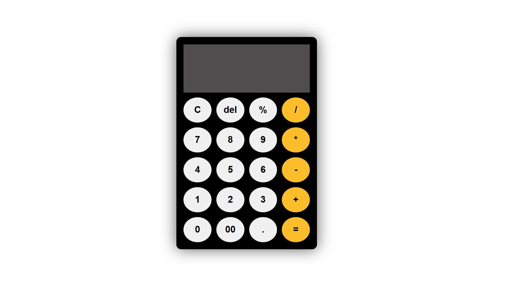

# 🧮 Simple Calculator App

A simple and responsive calculator built using **HTML, CSS, and JavaScript**. It performs basic arithmetic operations through a clean and user-friendly interface.

## 📸 Screenshot


## ✨ Features
- Perform basic arithmetic operations
- Addition (+)
- Subtraction (-)
- Multiplication (*)
- Division (/)
- Percentage (%)
- Decimal number support
- Clear (`C`) button
- Delete (`Del`) button to remove the last character
- Responsive and clean user interface
- Built using vanilla JavaScript (no external libraries)

## 🛠️ Technologies Used
- HTML5
- CSS3
- JavaScript (ES6)

## 🚀 How to Run the Project
1. Clone this repository
```bash
git clone https://github.com/your-username/simple-calculator-app.git
```
2. Open the project folder.
3. Open **index.html** in your browser.
   
## 💡 What I Learned

While building this project, I practiced:
- DOM manipulation
- Event handling
- JavaScript functions
- Working with strings
- Using `eval()` to evaluate mathematical expressions
- Building interactive user interfaces
- Organizing HTML, CSS, and JavaScript into separate files

## 📌 Future Improvements
- Keyboard support
- Calculation history
- Dark/Light mode
- Scientific calculator functions
- Replace `eval()` with a custom expression parser for better security

## 👩‍💻 Author
**Javeria Nisar**
**Javeria Nisar**

If you found this project helpful, feel free to ⭐ the repository.
